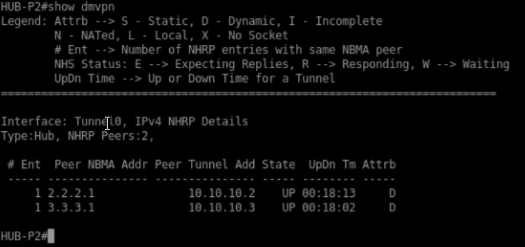
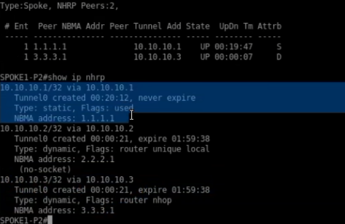
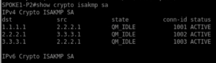
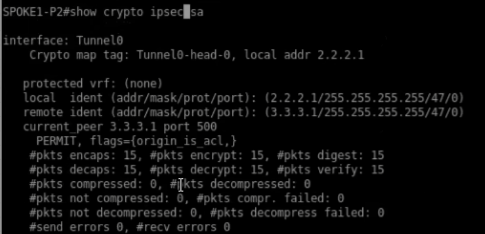
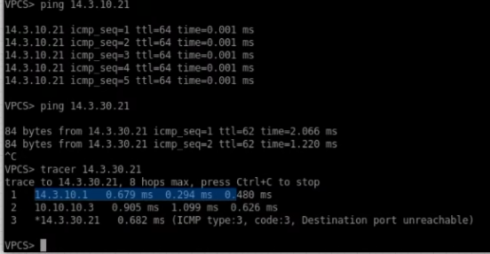

<h1>Instituto Tecnológico de Las Américas (ITLA)</h1>
  
<h2>Configuración y Verificación de DMVPN Fase 2 con IKEv1 y Enrutamiento Dinámico (OSPF)</h2>

Documentación Técnica Profesional — Práctica 5 (Semana 6)

   

<strong>Estudiante:</strong> Alan Daniel Garcia Mendez 
<strong>Matrícula:</strong> 2025-1403 
<strong>Carrera:</strong> Seguridad Informática 
<strong>Asignatura:</strong> Seguridad de Redes 
<strong>Docente:</strong> Jonathan Esteban Rondon Corniel 
<strong>Fecha de Entrega:</strong> 2 de julio de 2026 
<strong>Video de Exposición:</strong> <a href="https://youtu.be/iFX56J-Er5Y">https://youtu.be/iFX56J-Er5Y</a> 
<strong>Repositorio de GitHub:</strong> <a href="https://github.com/imAlanG16/07_dmvpn_phase2_ikev1_dynamic">https://github.com/imAlanG16/07_dmvpn_phase2_ikev1_dynamic</a>

## Objetivo de la VPN
Implementar una red privada virtual dinámica multipunto (DMVPN - Dynamic Multipoint VPN) de Fase 2, utilizando IPSec con IKEv1 para el cifrado y OSPF como protocolo de enrutamiento dinámico. El objetivo de la Fase 2 de DMVPN es permitir que las sucursales (Spokes) se registren de forma dinámica con la sede principal (Hub) utilizando el protocolo NHRP (Next Hop Resolution Protocol). En esta fase, cuando un Spoke necesita enviar tráfico a otro Spoke, le solicita la resolución de dirección al Hub y establece un túnel GRE dinámico **directamente Spoke-to-Spoke** sin que el tráfico de datos tenga que transitar a través del Hub, optimizando el ancho de banda y reduciendo la latencia de la red corporativa.

## Topología de Red y Direccionamiento
La topología lógica del laboratorio utiliza una nube pública simulada por el ISP de tránsito. Se define un direccionamiento de túnel lógico multipunto mGRE bajo el rango `10.10.10.0/24`.

  
  
Topología física del entorno DMVPN de laboratorio en GNS3

El direccionamiento configurado para las interfaces físicas y lógicas del laboratorio se detalla a continuación:

| Dispositivo / Rol | Interfaz WAN (IP/GW) | Interfaz LAN IP | Túnel mGRE (IP/DR) |
| :--- | :--- | :--- | :--- |
| **Router HUB-P2** | `1.1.1.1/24` (GW: `.254`) | `14.3.10.1/24` | `10.10.10.1/24` (Prioridad DR: 255) |
| **Router SPOKE1-P2** | `2.2.2.1/24` (GW: `.254`) | `14.3.20.1/24` | `10.10.10.2/24` (Prioridad DR: 0) |
| **Router SPOKE2-P2** | `3.3.3.1/24` (GW: `.254`) | `14.3.30.1/24` | `10.10.10.3/24` (Prioridad DR: 0) |

## Parámetros Criptográficos y de Red
Los parámetros configurados para la seguridad IPSec y el enrutamiento dinámico en el entorno de Fase 2 son:

| Tecnología | Parámetro | Valor Configurado | Descripción |
| :--- | :--- | :--- | :--- |
| **IKEv1** | Algoritmo Cifrado | AES-256 | Cifrado simétrico de Fase 1. |
| **IKEv1** | Hash / Auth | SHA / Pre-share | Autenticación basada en clave compartida `DMVPN123`. |
| **IKEv1** | DH Group | Group 14 (2048-bit) | Intercambio Diffie-Hellman seguro. |
| **IPSec** | Transform-Set | `TS-DMVPN-IKEV1` | Cifrado `esp-aes 256 esp-sha-hmac` en modo transporte. |
| **NHRP** | ID / Auth | `100` / `DMVPNKEY` | Red lógica de resolución NHRP y clave de autenticación. |
| **Enrutamiento** | Protocolo Dinámico | OSPF Área 0 (Proceso 10) | Redes anunciadas: LANs y red del Túnel. |
| **OSPF** | Tipo de Red | Broadcast | Habilita adjacencias dinámicas simulando broadcast. |

## Explicación de la Configuración y OSPF
En la Fase 2 de DMVPN, cada Spoke se configura con `tunnel mode gre multipoint` y establece un mapeo estático inicial hacia el Hub (`ip nhrp map 10.10.10.1 1.1.1.1`) y su envío multicast (`ip nhrp map multicast 1.1.1.1`), definiendo al Hub como Next Hop Server (NHS). El Hub utiliza mapeo multicast dinámico para aprender qué Spokes están activos. 

Para habilitar la comunicación directa Spoke-to-Spoke en la Fase 2, se utiliza el tipo de red OSPF **`broadcast`**. Para que OSPF funcione en esta topología NBMA, es imperativo que el Hub sea elegido como el Router Designado (DR) único de la red. Por lo tanto, el Hub se configura con prioridad `255` (`ip ospf priority 255`) y ambos Spokes se configuran con prioridad `0` (`ip ospf priority 0`) para evitar que participen en la elección.

Los scripts detallados aplicados se encuentran en: [script_configuracion.txt](resources/script_configuracion.txt).

## Verificación de Funcionamiento

### 1. Registro de Spokes en el Next Hop Server (HUB)
Para comprobar que la Fase 2 de DMVPN y el intercambio NHRP se han iniciado con éxito en la sede central, se ejecuta el comando `show dmvpn` en el router `HUB-P2`. La salida confirma que hay **2 peers registrados dinámicamente** (`NHRP Peers: 2`).

El Hub reporta a ambos Spokes activos con sus respectivas IPs WAN públicas y sus IPs virtuales correspondientes en estado **`UP`** con el atributo **`D`** (Dynamic):
* Peer `2.2.2.1` ➔ IP de Túnel `10.10.10.2` (SPOKE1)
* Peer `3.3.3.1` ➔ IP de Túnel `10.10.10.3` (SPOKE2)

  
  
Salida de show dmvpn en el HUB-P2 mostrando a los dos Spokes registrados dinámicamente

### 2. Tabla de Mapeo NHRP en los Spokes (Resolución de Siguiente Salto)
Al ejecutar el comando `show ip nhrp` en `SPOKE1-P2`, se valida la forma en la que la sucursal resuelve el mapeo lógico a físico. Se documentan las siguientes entradas en la base de datos NHRP:
1. Una entrada estática (**`static`**) que apunta al Hub `10.10.10.1` bajo la IP WAN `1.1.1.1` (nunca expira).
2. Una entrada dinámica propia (`10.10.10.2`).
3. Una entrada dinámica (**`dynamic`**) resuelta directamente para comunicarse con el Spoke 2: **`10.10.10.3/32 via 10.10.10.3`** con la dirección WAN física `3.3.3.1` y la bandera **`router nhop`**. Esto demuestra que el Spoke 1 ha resuelto la ubicación física de la sucursal de destino directamente mediante el protocolo NHRP.

  
  
Detalles de la tabla NHRP en SPOKE1-P2 mostrando la ruta aprendida para SPOKE2

### 3. Asociaciones de Seguridad Criptográfica Activas (ISAKMP SAs)
La ejecución del comando `show crypto isakmp sa` en el router `SPOKE1-P2` revela un comportamiento dinámico fantástico exclusivo de la Fase 2 de DMVPN. El router mantiene activos los canales seguros bidireccionales con sus contrapartes:
* Conexión con el Hub: Peer `1.1.1.1` en estado **`QM_IDLE`**.
* Conexión directa con el Spoke 2: Peer `3.3.3.1` en estado **`QM_IDLE`** (generada de forma dinámica bajo demanda).

Esto confirma que el Spoke 1 cifra y negocia sus parámetros ISAKMP de forma totalmente directa con Spoke 2, sin usar el Hub como intermediario para el descifrado del canal.

  
  
Asociaciones ISAKMP activas en SPOKE1-P2 con el HUB y el SPOKE2 en simultáneo

### 4. Asociación de Datos IPSec en el Enlace Directo (Fase 2)
Al ejecutar el comando `show crypto ipsec sa` en `SPOKE1-P2`, se detalla la SA IPSec de datos establecida directamente hacia el Spoke 2:
* `local ident: (2.2.2.1/255.255.255.255/47/0)` (Protocolo GRE en Spoke 1)
* `remote ident: (3.3.3.1/255.255.255.255/47/0)` (Protocolo GRE en Spoke 2)
* `current_peer: 3.3.3.1 port 500`

Los contadores de tráfico comprueban el paso seguro de paquetes Spoke-to-Spoke:
* **`#pkts encaps: 15`** y **`#pkts encrypt: 15`**
* **`#pkts decaps: 15`** y **`#pkts decrypt: 15`**

Esto ratifica la existencia de un canal IPSec directo establecido de sucursal a sucursal.

  
  
Detalles de la SA IPSec dinámica directa entre SPOKE1 y SPOKE2

### 5. Prueba de Conectividad y Trazado de Ruta Directo Spoke-to-Spoke
La validación final se realiza desde la consola del cliente VPCS en el extremo de Spoke 1. En primer lugar, se realiza un ping exitoso hacia el host detrás del Hub (`14.3.10.21`). Luego, al enviar paquetes hacia el host de Spoke 2 (`14.3.30.21`), los paquetes se completan de forma exitosa y sin pérdidas.

Finalmente, al trazar la ruta con `tracer 14.3.30.21`, se comprueba de forma empírica la naturaleza de la Fase 2:
1. El primer salto se dirige al gateway local de la LAN `14.3.10.1` (interfaz del router Spoke 1).
2. El segundo salto transita a la IP **`10.10.10.3`** (IP del túnel de Spoke 2). Esto comprueba que el enrutamiento y la encapsulación GRE/IPSec envían el tráfico directamente a Spoke 2, sin pasar lógicamente por el Hub (`10.10.10.1`).
3. El tercer salto alcanza al host de destino `14.3.30.21`.

  
  
Prueba de conectividad desde VPCS validando el salto directo entre subredes de Spokes

